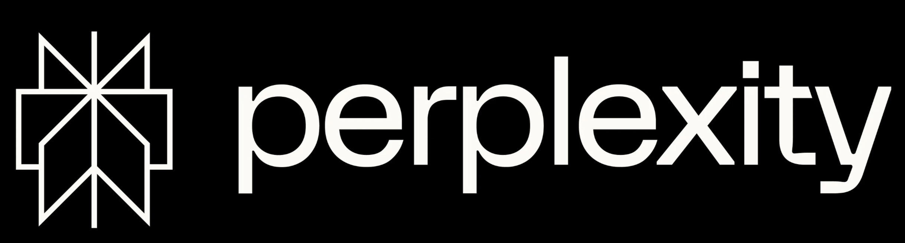

# NumHack PyData Impact AI Hackathon 🤖🌍

## Overview
NumHack is a three-day hybrid hackathon focused on open-source, AI, and scientific computing technologies, addressing environmental, economic, and socio-cultural challenges. Participants will have the opportunity to engage with mentors, attend workshops, and submit projects in one of three technical categories: **Build, Train, and Analyse**.

Organized by the PyData Impact Scholarship Program, a NumFOCUS initiative, and led by the NumHack committee of scholars and volunteers, the event is committed to promoting education and advancing AI for good. The main event will take place from November 22 to 24, 2024, with team formation starting the week of November 4, 2024.

NumHack will run concurrently with offline events hosted by partnering [PyData Chapters](https://pydata.org/numhack#chapters). If you're interested in getting your chapter involved, click [here](https://pydata.org/numhack/pydata-chapters).

Participants can expect valuable learning experiences, networking opportunities, cloud credits, AMA sessions with industry experts, and the chance to win prizes and showcase their projects to the PyData global community.

## Registration 📝
Registration will be open till November 17th. Visit the [Numhack homepage](https://pydata.org/numhack) to access the registration form.

You can participate individually or in teams of 2 to 5 members. Team formation will kick off two weeks before the event on Discord, with the official channel opening during the week of November 4. Join us there to introduce yourselves, form teams, discuss topics, and share ideas.

## Important Dates 📅

**Team Formation:** Nov 4 - Nov 17 2024

**Hackathon:** Nov 22 - Nov 24

**Judging:** Nov 25 - December 3

**Winner announcement**: Dec 5, 9-10 am PST, during the PyData Global online event

### Schedule ⏰

See on our [Website](https://pydata.org/numhack#workshops)

## Project Guidelines 📋

### Technical Categories
#### Build 🛠️
Build applications that utilize existing machine learning algorithms or AI models. Submissions in this category should focus on practical applications that implement AI in innovative ways. This includes creating user-friendly software, web applications, or platforms that can use pre-existing AI models to solve problems in sectors such as healthcare, sustainability, or education.

#### Train 🚂
Architect and train models, customize existing algorithms, or fine-tune on novel datasets. Submissions should demonstrate the development of machine learning models trained to tackle specific challenges. This includes using custom datasets, modifying existing algorithms to better address nuanced problems, or optimizing models for enhanced performance. Projects should document the training process, including data preparation, model architecture, and performance evaluation.

#### Analyse 🔍
Use AI tools to derive insights, create visualizations, and inform decision-making. This category focuses on submissions that utilize AI for data analysis and interpretation. Projects should aim to uncover hidden patterns or insights within datasets or models. Submissions could include predictive modeling, visualization dashboards, or reports demonstrating how data analysis can be leveraged to improve understanding and outcomes in various fields. Submissions could also include deep dives into components of AI systems with a research focus.

## Submission Guidelines 🚀
**Submissions Deadline**: November 25, 12:00 UTC

**Submission Requirements**: Github repo with source code and documentation & 3-5 minute demo. [Details Here](Documentation/Submission_Guide.md)

Submit your project here during the hackathon: **[Project Submission](https://github.com/numfocus/numhack-2024/issues/new?assignees=&labels=&projects=&template=project.yml&title=Project%3A+%3Cshort+description%3E)**

## Tools, Resources, and Mentorship 🛠️👨‍🏫

**Requirements**: Computer, internet, GitHub for submission, Discord for chat, Airmeet for streams.

**Platform Credits**: $500 in compute credits available from Modal during event. Modal also includes $30/month in free credits so you can familiarize yourself with the platform. [Here](https://modal.com/)

**Mentors** will be available, assigned based on field of expertise and topic of interest.

### Workshops and Examples

- Building an Open Source RAG Pipeline - IBM, AI Alliance - Nov 14 17:00 UTC
- Finetuning Language Models - Andrew Siah - Nov 15 19:00 UTC
- Building Agentic and Multi-Agent Systems with LangGraph - [Dr. Greg Looughnane](https://www.linkedin.com/in/gregloughnane/) & [Chris "The Wiz" Alexiuk](https://www.linkedin.com/in/csalexiuk/) - Nov 22 14:00-16:00 UTC

[**See all workshops on Airmeet!**](https://www.airmeet.com/e/cc5a1690-8bf1-11ef-9d16-f500357a2a69)

### Modal Documentation and Guide
[Modal.com/docs](https://modal.com/docs)

### Datasets and sources
[Here](Documentation/Datasets.md)

## Winner Selection and Notification 🏆
Projects will be judged based on the following criteria:
- **Innovation and Creativity**: How novel and impactful is the idea?
- **Impact**: Does the solution solve the challenge meaningfully?
- **Technical Execution**: The quality and robustness of the solution.
- **Usability**: Can the project be realistically implemented?
- **Presentation and Documentation**: Clarity of the demo and documentation.

Judging will take place over a period of approximately one week, from November 25 to December 3, 2024. During this period, judges will review submissions and evaluate projects according to the outlined criteria. The process will include both an initial review stage and a final assessment round where top projects are discussed and scored.

Winners will be notified via email and through the official hackathon Discord channel on December 4, 2024. Additionally, the winners will be publicly announced during the PyData Global Conference on December 5, 2024, from 9-10 am PST. Participants are encouraged to join the live stream to celebrate the event and the innovative work being recognized.

## Prizes and awards 🥇

| Category           | 1st          | 2nd         | 3rd  |
| ------------------ | ------------ | ----------- | ---- |
| Build              | $700         | $500        | $300 |
| Train              | $700         | $500        | $300 |
| Analyse            | $700         | $500        | $300 |
| Community Favorite | $500         |
| Platform Credits   | $5000        | Modal       |
| Sponsor Award      | $500 credits | Lighting AI |

### Main Prizes 💰
Projects will be evaluated by a panel of judges, including domain professionals, AI experts, sustainability and social impact champions, industry experts, and company representatives. Judging criteria will include innovation, impact, technical execution, usability, and presentation and documentation. Cash prizes will be awarded for top 3 teams and each category: Build, Train, Analyse.

Prizes will be announced during the PyData Global Conference 📺! Tune in to the live stream to find out the winners and celebrate the innovative projects showcased at NumHack.

### Special Categories 🌟

#### Community Favorite 🏅
This special prize will be awarded to the project that garners the most support from the PyData community. Voting will take place during the PyData Global Conference, where attendees will have the opportunity to review and vote for their favorite project. The Community Favorite prize recognizes projects that resonate with and inspire the broader audience, showcasing creativity, impact, and relevance. The winner of the Community Favorite category will be announced live before the PyData Global Conference closing session on December 5, 2024.

#### Infrastructure Sponsor Award 🎖️
Modal, our infrastructure sponsor, will be awarding a special prize of $5,000 USD in Modal platform credits to one team that demonstrates the best and most innovative use of Modal's infrastructure within their project. The judging criteria for this award will focus on how effectively and creatively the team integrated Modal's services, showcasing the potential of cloud-native infrastructure in supporting AI development and deployment.

## Sponsors 🤝
A big thank you to our sponsors for making NumHack possible! Your generous support helps foster innovation, learning, and positive change through technology. We deeply appreciate the commitment of our sponsors who share our vision of advancing open-source AI and addressing global challenges.

### Infrastructure Partner 🌐
Modal - For providing essential cloud credits and a special award to showcase the best use of their platform.

### Silver Sponsors 🥈
Lighting AI - For sponsoring technically category prizes

### Community Partners 🌍

 &nbsp;&nbsp;&nbsp;  &nbsp;&nbsp;&nbsp;  &nbsp;&nbsp;&nbsp; 

## Other 📜

**Open License**: All submissions must conform to an open-source license, ie. CC BY-SA 4.0, MIT License, GNU GPL etc.

**Originality**: All solutions must be original or a significant improvement of pre-existing work.

**Code of Conduct**: Participants must adhere to a respectful and collaborative environment. [Here](https://numfocus.org/code-of-conduct)
